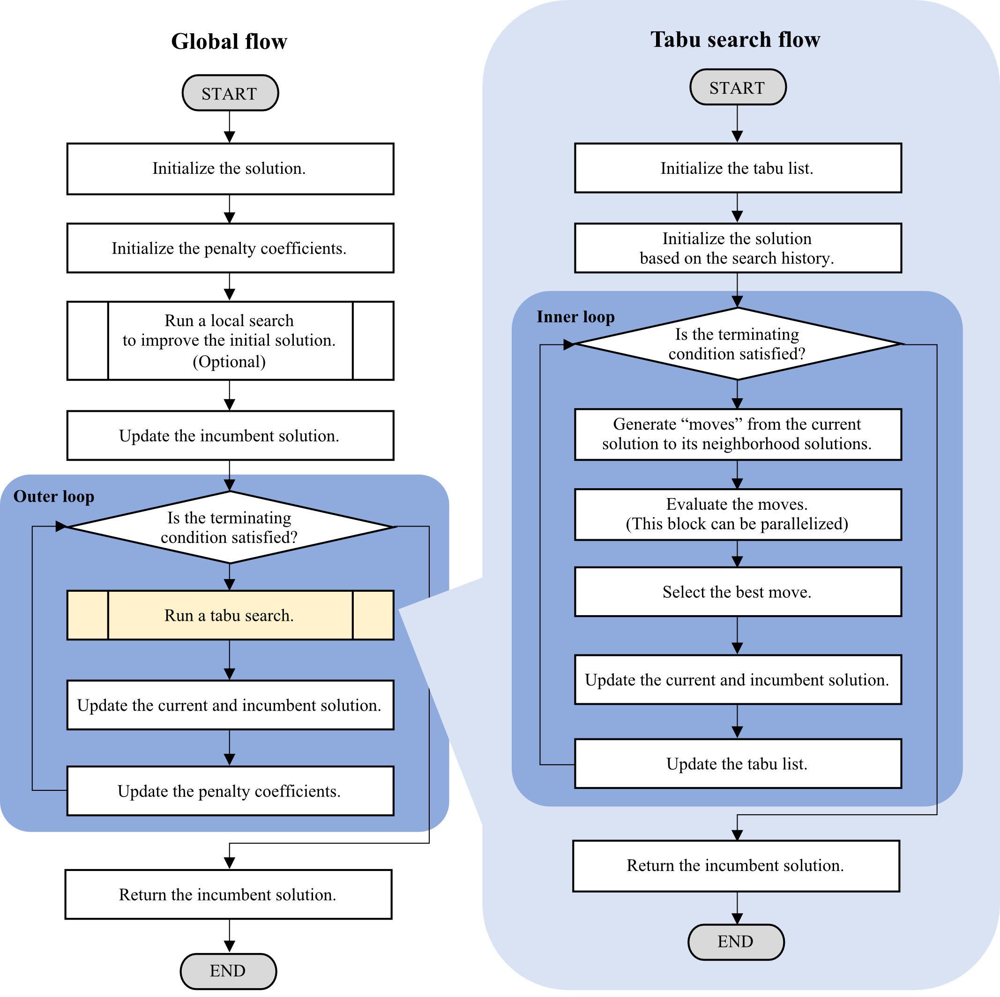

# cpp_metaheuristics
 [](https://www.codacy.com/manual/snowberryfield/cpp_metaheuristics?utm_source=github.com&amp;utm_medium=referral&amp;utm_content=snowberryfield/cpp_metaheuristics&amp;utm_campaign=Badge_Grade) [](https://opensource.org/licenses/MIT)

__cpp_metaheuristics__ (hereinafter referred to as __cppmh__) is a C++ metaheuristics modeler/solver library for general combinatorial optimization problems. cppmh emphasizes on the following aspects:
- __Portability.__ cppmh is implemented as a header-only library which does not depend on any other proprietary or open-source libraries. Users can integrate cppmh in to their own codes by just copying necessary files. 

- __Intuitiveness in modeling.__ cppmh provides an intuitive modeling environment to define a optimization model as a program code. Users can define constraint and objective functions using arithmetic operations on decision variables.

- __Flexibility to define neighborhood.__ cppmh automatically detects the neighborhood structure of the problem. In addition to this, cppmh also accepts user-defined neighborhood.

## Optimization in cpp_metaheuristics
cppmh can compute approximate solutions for __linear and nonlinear integer optimization problems__. cppmh employs __Tabu Search__ [1], a metaheuristics technique, to solve problems. In solving, cppmh replaces constraints with penalty functions which return violations to the corresponding constraints, and the penalty functions multiplied by positive penalty coefficients are added to the objective function. The penalty coefficients are updated iteratively and automatically in a method similar (not exact same) to the one proposed in paper [2].
The figure below shows the flow-chart of the algorithm of cppmh. 

<div align="center">



__The Flow-Chart of the optimization algorithm of cppmh.__ 

</div>

## Installation
Installation of cppmh is just completed by copying the [`cppmh/`](cppmh/) directory to an appropriate location. 

## Example
Let us consider a simple linear integer optimization problem [3]:
```
   (P1):  minimize       x_1 + 10 x_2
             x
         subject to   66 x_1 + 14 x_2 >= 1430,
                     -82 x_1 + 28 x_2 >= 1306,
                     x_1 and x_2 are integer.
```

The following code shows an implementation code to solve the problem (P) using cppmh.
```c++
#include <cppmh.h>
int main(void) {
    // (1) Modeling
    cppmh::model::IPModel model;

    auto& x = model.create_variables("x", 2);
    auto& g = model.create_constraints("g", 2);

    g(0) =  66 * x(0) + 14 * x(1) >= 1430;
    g(1) = -82 * x(0) + 28 * x(1) >= 1306;
    model.minimize(x(0) + 10 * x(1));

    // (2) Running Solver
    auto result = cppmh::solver::solve(&model);

    // (3) Accessing the Result
    std::cout << "objective = " << result.objective() << std::endl;
    std::cout << "x(0) = "      << result.variables("x").values(0) << std::endl;
    std::cout << "x(1) = "      << result.variables("x").values(1) << std::endl;

    return 0;
}
```
By compiling the code above and then running the generated executable, users will obtain the following result:
```bash
objective = 707
x(0) = 7
x(1) = 70
```
Following additional examples are provided in [`example/`](example/) directory.
- [`example/knapsack.cpp`](example/knapsack.cpp) solves a knapsack problem which considers maximization of total prices of items to be included in a "knapsack" with satisfying two constraints, volume and weight capacities. 
- [`example/bin_packing.cpp`](example/bin_packing.cpp) solves a bin-packing problem which considers minimization of the number of bin to pack all given items. 
- [`example/sudoku.cpp`](example/sudoku.cpp) solves a "Sudoku" puzzle [4] as a binary integer programming problem.
- [`example/quadratic_assignment.cpp`](example/quadratic_assignment.cpp) solves a quadratic assignment problem as an example of optimization that incorporates nonlinear functions and user-defined neighborhoods. 

## Compilation
A source code of program integrating cppmh can be compiled by C++14 standards compatible compilers with specifying include search path where cppmh is installed. For instance, the example code [`example/knapsack.cpp`](example/knapsack.cpp) can be built by following command using g++:
```
$g++ -std=c++14 -O2 -I path/to/cppmh [-fopenmp] sample/knapsack.cpp -o knapsack.exe
```

The option `-fopenmp` is required to activate parallel computation. See [Solver Options](document/solver_option_guide.md) for details.

Following combinations of operating systems and compilers are confirmed compilation possible:

|   Operating System   |                      Compiler (version)                      |
|:--------------------:|:------------------------------------------------------------:|
|  macOS Mojave 10.14  |                     gcc (9.3.0 Homebrew)                     |
| macOS Catalina 10.15 |                 gcc (8.4.0, 9.3.0 Homebrew)                  |
|     Ubuntu 16.04     | gcc (7.4.0, 8.3.0, 9.2.1) <br /> clang (6.0.0, 8.0.0, 9.0.1) |
|     Ubuntu 18.04     | gcc (7.5.0, 8.4.0, 9.2.1) <br /> clang (6.0.0, 8.0.0, 9.0.0) |

## Documents
- [Starter Guide](document/starter_guide.md) describes the basic usage of cppmh including modeling of optimization problems, running the solver, and accessing the optimization results.
- [Solver Option Guide](document/solver_option_guide.md) gives a detailed description of the all options and their default values.

## License
__cpp_metaheuristics__ is licensed under [MIT license](https://opensource.org/licenses/MIT).

## References

- [1] F.Glover: [Future Paths for Integer Programming and Links to Artificial Intelligence](http://leeds-faculty.colorado.edu/glover/TS%20-%20Future%20Paths%20for%20Integer%20Programming.pdf), _Computers and Operations Research_, Vol.13 No.5 pp.533-549 (1986).

- [2] K.Nonobe and T.Ibaraki: [An improved tabu search method for the weighted constraint satisfaction problem](https://www.researchgate.net/publication/228737620_An_Improved_Tabu_Search_Method_For_The_Weighted_Constraint_Satisfaction_Problem), _INFOR_ Vol.39, No.1 pp.131–151 (2001).

- [3] R.Fletcher: [Practical Methods of Optimization, Second Edition](https://onlinelibrary.wiley.com/doi/book/10.1002/9781118723203), John Wiley & Sons (2000).

- [4] Wikipedia "Sudoku" : https://en.wikipedia.org/wiki/Sudoku