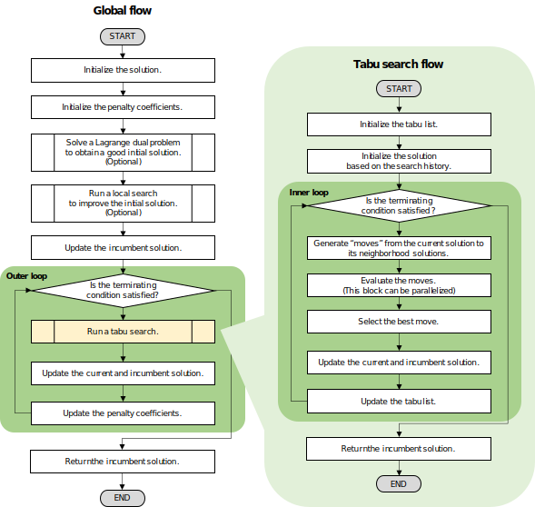

[Abstract](#abstract) | [News](#news) | [Algorithm](#algorithm) | [Installation](#installation) | [Example](#example) | [Compilation](#compilation) | [Standalone Solver](#standalone-solver) | [Documents](#documents) | [Benchmark](#benchmark) | [Test](#test) | [License](#license) | [References](#references)


## Abstract
__PRINTEMPS__ is a C++ metaheuristics modeler/solver library for general integer optimization problems. PRINTEMPS emphasizes on the following aspects:
- __Portability.__ It is implemented as a header-only library which does not depend on any other proprietary or open-source libraries. Users can integrate it in to their own codes by just copying necessary files. 

- __Intuitiveness in modeling.__ It provides an intuitive modeling environment to define a optimization model as a program code. Users can define constraint and objective functions using arithmetic operations on decision variables.

- __Flexibility to define neighborhood.__ It automatically detects the neighborhood structure of the problem. In addition to this, PRINTEMPS also accepts user-defined neighborhood.

## News
|     Date      | Update                                                                                            |
|:-------------:|:--------------------------------------------------------------------------------------------------|
| Jul. 5, 2021  | New benchmark results were added.                                                                 |
| Jun. 29, 2021 | New benchmark results were added.                                                                 |
| Jun. 26, 2021 | [PRINTEMPS v1.6.3](https://github.com/snowberryfield/printemps/releases/tag/v1.6.2) was released. |

## Algorithm
PRINTEMPS can compute approximate solutions for __linear and nonlinear integer optimization problems__. It employs __Tabu Search__ [1], a metaheuristics technique, to solve problems. In solving, it replaces constraints with penalty functions which return violations to the corresponding constraints, and the penalty functions multiplied by positive penalty coefficients are added to the objective function. The penalty coefficients are updated iteratively and automatically in a method similar (not exact same) to the one proposed in paper [2].
The figure below shows the flow-chart of the algorithm of PRINTEMPS. 

<div align="center">



__The flow-chart of the optimization algorithm of PRINTEMPS.__ 

</div>

## Installation
Installation of PRINTEMPS is just completed by cloning the [repository](https://github.com/snowberryfield/printemps/) (or downloading the [latest archive](https://github.com/snowberryfield/printemps/releases)) and then copying the [`printemps/`](https://github.com/snowberryfield/printemps/tree/master/printemps/) directory in the repository to an appropriate location. 

## Example
Let us consider a simple linear integer optimization problem [3]:
```
   (P1):  minimize       x_1 + 10 x_2
             x
         subject to   66 x_1 + 14 x_2 >= 1430,
                     -82 x_1 + 28 x_2 >= 1306,
                     x_1 and x_2 are integer.
```

The following code shows an implementation code to solve the problem (P) using PRINTEMPS.
```c++
#include <printemps.h>
int main(void) {
    // (1) Modeling
    printemps::model::IPModel model;

    auto& x = model.create_variables("x", 2);
    auto& g = model.create_constraints("g", 2);

    g(0) =  66 * x(0) + 14 * x(1) >= 1430;
    g(1) = -82 * x(0) + 28 * x(1) >= 1306;
    model.minimize(x(0) + 10 * x(1));

    // (2) Running Solver
    auto result = printemps::solver::solve(&model);

    // (3) Accessing the Result
    std::cout << "objective = " << result.solution.objective() << std::endl;
    std::cout << "x(0) = "      << result.solution.variables("x").values(0) << std::endl;
    std::cout << "x(1) = "      << result.solution.variables("x").values(1) << std::endl;

    return 0;
}
```
By compiling the code above and then running the generated executable, users will obtain the following result:
```bash
objective = 707
x(0) = 7
x(1) = 70
```
Following additional examples are provided in [`example/`](https://github.com/snowberryfield/printemps/tree/master/example/) directory.
- [`example/knapsack.cpp`](https://github.com/snowberryfield/printemps/tree/master/example/knapsack.cpp) solves a knapsack problem which considers maximization of total prices of items to be included in a "knapsack" with satisfying two constraints, volume and weight capacities. 
- [`example/bin_packing.cpp`](https://github.com/snowberryfield/printemps/tree/master/example/bin_packing.cpp) solves a bin-packing problem which considers minimization of the number of bin to pack all given items. 
- [`example/sudoku.cpp`](https://github.com/snowberryfield/printemps/tree/master/example/sudoku.cpp) solves a "Sudoku" puzzle [4] as a binary integer programming problem.
- [`example/quadratic_assignment.cpp`](https://github.com/snowberryfield/printemps/tree/master/example/quadratic_assignment.cpp) solves a quadratic assignment problem as an example of optimization that incorporates nonlinear functions and user-defined neighborhoods. 

## Compilation
A C++ program integrating PRINTEMPS can be compiled by C++14 standards compatible compilers with specifying include search path where it is installed. For instance, the example code [`example/knapsack.cpp`](https://github.com/snowberryfield/printemps/tree/master/example/knapsack.cpp) can be built by the following command using g++:
```
$g++ -std=c++14 -O3 -I path/to/printemps [-fopenmp] sample/knapsack.cpp -o knapsack.exe
```

The option `-fopenmp` is required to activate parallel computation. See [Solver Option Guide](./contents/solver_option_guide.md) for details.

Following combinations of operating systems and compilers are confirmed compilation possible:

|   Operating System   |        Compiler (version)        |
|:--------------------:|:--------------------------------:|
|  macOS Mojave 10.14  |       gcc (9.3.0 Homebrew)       |
| macOS Catalina 10.15 |       gcc (9.3.0 Homebrew)       |
|     Ubuntu 16.04     | gcc (9.2.1) <br /> clang (9.0.1) |
|     Ubuntu 18.04     | gcc (9.2.1) <br /> clang (9.0.0) |


## Standalone Solver
A standalone executable solver based on PRINTEMPS is also provided. It approximately solves a pure integer programming problem described as MPS (Mathematical Programming System) format file. The solver is powered by [nlohmann_json](https://github.com/nlohmann/json), an external JSON parser/generator.
The solver can be built by the following command:
```
$g++ -std=c++14 -O3 -I path/to/printemps -I path/to/nlohmann_json [-fopenmp] application/mps_solver/main.cpp -o mps_solver.exe
```
where `path/to/printemps`and`path/to/nlohmann_json`respectively denote the installation paths of PRINTEMPS and nlohmann_json. Alternatively, the solver can also be build with the following command:
```
$make -f makefile/Makefile.external [CC=gcc CXX=g++]
$make -f makefile/Makefile.application [CC=gcc CXX=g++]
```
where the options `CC` and `CXX` respectively designate the paths of C and C++ compilers, which should be specified according to the user's development environment. The former command includes the installation of nlohmann_json. The built solver will be generated at `build/application/Release/mps_solver.exe`.

The solver can be run by the following command:
```
$./mps_solver.exe mps_file [-p option_file] [--accept-continuous] 
```
where the argument `mps_file` is the path of the MPS file. The argument `-p option_file` is optional and it specifies solver options and parameters via a JSON file. If the optional flag `--accept-continuous` is activated, the solver accepts an MPS file which includes continuous variables. Then the continuous variables will be regarded as integer variables. An example of solver option JSON file is provided as [`application/dat/option.json`](https://github.com/snowberryfield/printemps/blob/master/application/dat/option.json).

## Documents
- [Starter Guide](./contents/starter_guide.md) describes the basic usage of PRINTEMPS including modeling of optimization problems, running the solver, and accessing the optimization results.
- [Solver Option Guide](./contents/solver_option_guide.md) gives a detailed description of the all options and their default values.


## Benchmark
Optimization performance of PRINTEMPS has been evaluated using pure integer instances of [MIPLIB 2017](https://miplib.zib.de). Please refer [Benchmark Results](./contents/benchmark/index.md) for detail.


## Test
The test suites for PRINTEMPS are powered by [googletest](https://github.com/google/googletest). The command
```
$make -f makefile/Makefile.external [CC=gcc CXX=g++]
```
installs googletest into `external/` directory. The options `CC` and `CXX` respectively designate the paths of C and C++ compilers, which should be specified according to the user's development environment. After the installation of googletest, execute the command
```
$make -f makefile/Makefile.test
```
to build and run the test suites.

## License
__PRINTEMPS__ is licensed under [MIT license](https://opensource.org/licenses/MIT).

## References

- [1] F.Glover: [Future Paths for Integer Programming and Links to Artificial Intelligence](http://leeds-faculty.colorado.edu/glover/TS%20-%20Future%20Paths%20for%20Integer%20Programming.pdf), _Computers and Operations Research_, Vol.13 No.5 pp.533-549 (1986).

- [2] K.Nonobe and T.Ibaraki: [An improved tabu search method for the weighted constraint satisfaction problem](https://www.researchgate.net/publication/228737620_An_Improved_Tabu_Search_Method_For_The_Weighted_Constraint_Satisfaction_Problem), _INFOR_ Vol.39, No.2 pp.131–151 (2001).

- [3] R.Fletcher: [Practical Methods of Optimization, Second Edition](https://onlinelibrary.wiley.com/doi/book/10.1002/9781118723203), John Wiley & Sons (2000).

- [4] Wikipedia "Sudoku" : https://en.wikipedia.org/wiki/Sudoku