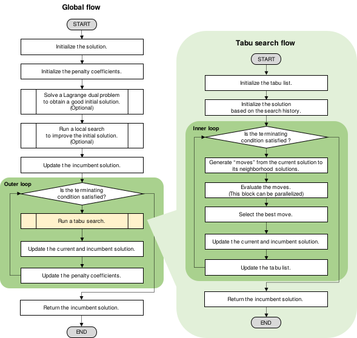

[Abstract](#abstract) | [News](#news) | [Algorithm](#algorithm) | [Installation](#installation) | [Example](#example) | [Compilation](#compilation) | [Standalone Solver](#standalone-solver) | [Documents](#documents) | [Benchmark](#benchmark) | [Test](#test) | [License](#license) | [References](#references) | [Citation](#citation)


## Abstract
__PRINTEMPS__ (PoRtable INTEger Mathematical Programming Solver) is a C++ metaheuristic modeler/solver library (now with official Python bindings) for general linear integer optimization problems. PRINTEMPS emphasizes the following aspects:
- __Portability.__ It is implemented as a header-only library that does not depend on any other proprietary or open-source libraries. Users can integrate it into their own code by simply copying the necessary files. 

- __Intuitiveness in modeling.__ It provides an intuitive modeling environment to define an optimization model directly in code. Users can define constraints and objective functions using arithmetic operations on decision variables.

- __Flexibility in defining neighborhoods.__ It automatically detects the neighborhood structure of the problem. In addition to this, PRINTEMPS also accepts user-defined neighborhoods.

## News
|     Date      | Update                                                                                            |
|:-------------:|:--------------------------------------------------------------------------------------------------|
| Jul. 21, 2026 | [PRINTEMPS v2.9.0](https://github.com/snowberryfield/printemps/releases/tag/v2.9.0) was released. |
| Feb. 8, 2024 | [Tabu Search-Based Heuristic Solver for General Integer Linear Programming Problems](https://ieeexplore.ieee.org/document/10418217), a paper on PRINTEMPS, has been published in IEEE Access. |

## Algorithm
PRINTEMPS can compute approximate solutions for __integer linear programming problems__ using __Weighted Tabu Search__ [1]. For more information on the algorithm, please refer to the paper [2]. The figure below shows the flow-chart of the algorithm of PRINTEMPS. 

<div align="center">



__The flow-chart of the optimization algorithm of PRINTEMPS.__ 

</div>

## Installation
To install PRINTEMPS for C++, simply clone the [repository](https://github.com/snowberryfield/printemps/) (or download the [latest archive](https://github.com/snowberryfield/printemps/releases)) and then copy the [`printemps/`](https://github.com/snowberryfield/printemps/tree/master/printemps/) directory in the repository to an appropriate location. 

For Python, it can be installed from the repository root:
```bash
$ pip install ./python
``` 

## Example
Let us consider a simple linear integer optimization problem [3]:
```
   (P):   minimize       x_1 + 10 x_2
             x
         subject to   66 x_1 + 14 x_2 >= 1430,
                     -82 x_1 + 28 x_2 >= 1306,
                     x_1 and x_2 are integer.
```

The following code shows the implementation to solve the problem (P) using PRINTEMPS.
```c++
#include <printemps.h>
int main(void) {
    // (1) Modeling
    printemps::model::IPModel model;

    auto& x = model.create_variables("x", 2);
    auto& g = model.create_constraints("g", 2);

    g(0) =  66 * x(0) + 14 * x(1) >= 1430;
    g(1) = -82 * x(0) + 28 * x(1) >= 1306;
    model.minimize(x(0) + 10 * x(1));

    // (2) Running Solver
    auto result = printemps::solver::solve(&model);

    // (3) Accessing the Result
    std::cout << "objective = " << result.solution.objective() << std::endl;
    std::cout << "x(0) = "      << result.solution.variables("x").values(0) << std::endl;
    std::cout << "x(1) = "      << result.solution.variables("x").values(1) << std::endl;

    return 0;
}
```
By compiling the code above and then running the generated executable, users will obtain the following result:
```bash
objective = 707
x(0) = 7
x(1) = 70
```
The following additional examples are provided in the [`example/`](https://github.com/snowberryfield/printemps/tree/master/example/) directory.
- [`example/knapsack.cpp`](https://github.com/snowberryfield/printemps/tree/master/example/knapsack.cpp) solves a knapsack problem, maximizing the total value of items included in a "knapsack" subject to volume and weight capacity constraints. 
- [`example/bin_packing.cpp`](https://github.com/snowberryfield/printemps/tree/master/example/bin_packing.cpp) solves a bin-packing problem, minimizing the number of bins required to pack a set of items. 
- [`example/sudoku.cpp`](https://github.com/snowberryfield/printemps/tree/master/example/sudoku.cpp) solves a "Sudoku" puzzle [4] formulated as a binary integer programming problem.

## Compilation
A C++ program integrating PRINTEMPS can be compiled using a C++17-compatible compiler by specifying the include search path to where PRINTEMPS is located. For instance, the example code [`example/knapsack.cpp`](https://github.com/snowberryfield/printemps/tree/master/example/knapsack.cpp) can be built by the following command using g++:
```
$g++ -std=c++17 -O3 -I path/to/printemps [-fopenmp] sample/knapsack.cpp -o knapsack
```

Alternatively, you can compile all examples and targets using the root-level `Makefile` by running `make` or `make example` from the repository root.

The option `-fopenmp` is required to activate parallel computation. See [Solver Option Guide](./contents/solver_option_guide.md) for details.

Following combinations of operating systems and compilers are confirmed compilation possible:

|      Operating System     | Compiler (version)                                           |
| :-----------------------: | :----------------------------------------------------------- |
|          macOS 14         | gcc 12.4.0, 13.4.0, 14.3.0, 15.1.0                           |
|          macOS 15         | gcc 12.4.0, 13.4.0, 14.3.0, 15.1.0                           |
|        Ubuntu 22.04       | gcc 12.3.0 <br> clang 13.0.1, 14.0.0, 15.0.7         |
|        Ubuntu 24.04       | gcc 12.3.0, 13.3.0, 14.2.0 <br> clang 16.0.6, 17.0.6, 18.1.3 |
|        Windows 2022       | gcc 15.2.0 (MSYS2 / mingw64)                                 |


## Standalone Solver
A standalone executable solver based on PRINTEMPS is also provided. It approximately solves a pure integer programming problem stored in an MPS (Mathematical Programming System) format file. The solver can be built by the following command:
```
$make application [CC=gcc CXX=g++]
```
where the options `CC` and `CXX` respectively designate the paths of C and C++ compilers, which should be specified according to the user's development environment. The built solver will be generated in `build/application/Release/printemps`.


The solver can be run by the following command:
```
$./printemps mps_file [-p option_file] [--accept-continuous] 
```
where the argument `mps_file` is the path to the MPS file. The argument `-p option_file` is optional, which specifies solver options and parameters via a JSON file. If the optional flag `--accept-continuous` is activated, the solver accepts an MPS file that includes continuous variables. Then the continuous variables will be treated as integer variables. An example of solver option JSON file is provided as [`application/dat/option.json`](https://github.com/snowberryfield/printemps/blob/master/application/dat/option.json).

## Documents
- [Starter Guide](./contents/starter_guide.md) covers the basic usage of PRINTEMPS, including modeling of optimization problems, running the solver, and accessing the optimization results.
- [Solver Option Guide](./contents/solver_option_guide.md) gives a detailed description of the all options and their default values.


## Benchmark
Optimization performance of PRINTEMPS has been evaluated using pure integer instances of [MIPLIB 2017](https://miplib.zib.de). Please refer to [Benchmark Results](./contents/benchmark/index.md) for detail.


## Test
The test suites for PRINTEMPS are powered by [googletest](https://github.com/google/googletest). GoogleTest will be automatically fetched during configuration. Execute the following command from the repository root to build and run the test suites:
```
$make run-test [CC=gcc CXX=g++]
```

## License
__PRINTEMPS__ is licensed under [MIT license](https://opensource.org/licenses/MIT).

## References

- [1] K.Nonobe and T.Ibaraki: [An improved tabu search method for the weighted constraint satisfaction problem](https://www.researchgate.net/publication/228737620_An_Improved_Tabu_Search_Method_For_The_Weighted_Constraint_Satisfaction_Problem), _INFOR_, Vol.39, pp.131–151 (2001).
- [2] Y.Koguma: [Tabu Search-Based Heuristic Solver for General Integer Linear Programming Problems](https://ieeexplore.ieee.org/document/10418217), __IEEE Access__, Vol.12, pp.19059-19076 (2024).
- [3] R.Fletcher: [Practical Methods of Optimization, Second Edition](https://onlinelibrary.wiley.com/doi/book/10.1002/9781118723203), John Wiley & Sons (2000).
- [4] Wikipedia "Sudoku" : https://en.wikipedia.org/wiki/Sudoku

## Contributors
- Yuji Koguma ([@snowberryfield](https://github.com/snowberryfield))
- Masahiro Sakai ([@msakai](https://github.com/msakai))

## Citation
I would appreciate it if you could cite the following article when referring to PRINTEMPS in your work:
```
@ARTICLE{10418217,
  author={Koguma, Yuji},
  journal={IEEE Access}, 
  title={Tabu Search-Based Heuristic Solver for General Integer Linear Programming Problems}, 
  year={2024},
  volume={12},
  number={},
  pages={19059-19076},
  doi={10.1109/ACCESS.2024.3361323}}
```
